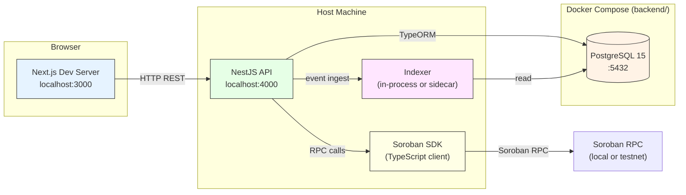
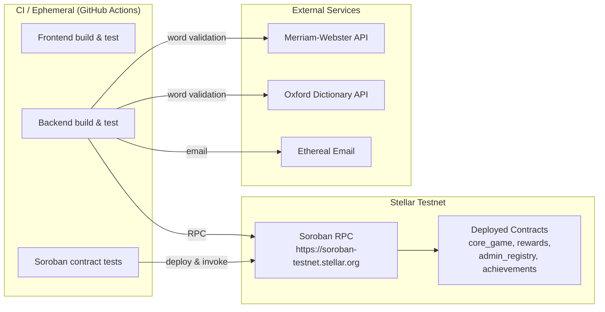
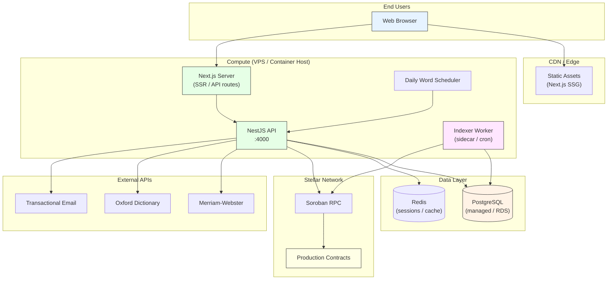
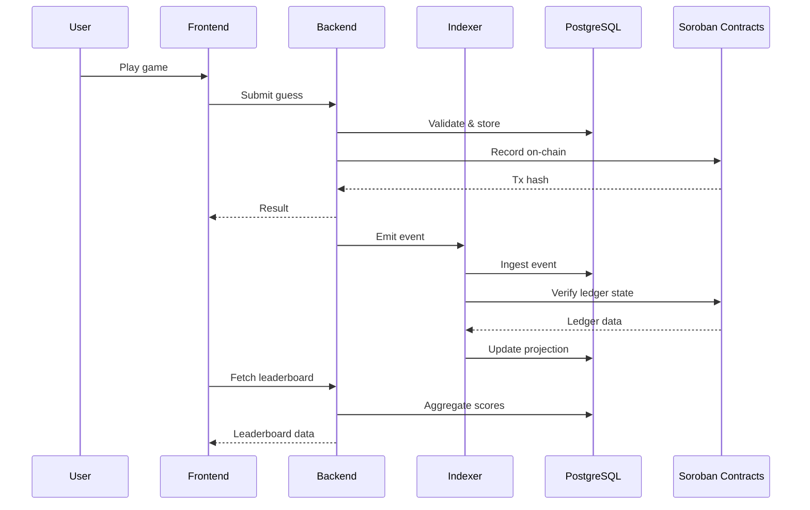

# Deploy Topology Diagrams

**ID:** INFRA-210

## Purpose

Provide a shared mental model of how the frontend, backend, indexer, and
Soroban pieces fit together in local, testnet, and production-like
deployments.

---

## 1. Local Development Topology



### Startup order

1. `docker compose -f backend/docker-compose.yml up -d` — starts PostgreSQL
2. `npm run start:dev --prefix backend` — starts NestJS + indexer
3. `npm run dev --prefix frontend` — starts Next.js dev server

---

## 2. Testnet Topology



### Testnet contract deployment order

```
admin_registry  →  core_game  →  rewards  →  achievements
      1               2             3              4
```

Contract IDs are persisted in `soroban/config/contracts.testnet.json`.

---

## 3. Production-like Topology



---

## 4. Component Data Flow



---

## 5. Network Boundary Summary

| Connection | Protocol | Local | Testnet | Production |
|---|---|---|---|---|
| FE ↔ BE | HTTP REST | `localhost:4000` | Ingress URL | Load-balanced URL |
| BE ↔ PostgreSQL | TCP (TypeORM) | `localhost:5432` | CI service container | Managed DB endpoint |
| BE ↔ Soroban RPC | JSON-RPC over HTTPS | `testnet` RPC | `testnet` RPC | `mainnet` RPC |
| BE ↔ Indexer | In-process / HTTP | `localhost:4000` | Sidecar | Sidecar |
| BE ↔ Dictionary APIs | HTTPS | Direct | Direct | Direct |

## Related

- [ARCHITECTURE.md](./ARCHITECTURE.md) — monorepo structure and runtime flow
- [SOROBAN_DEPLOYMENT_FLOW.md](./SOROBAN_DEPLOYMENT_FLOW.md) — contract deployment steps
- [PERSISTENT_VOLUME_SEED_DATA.md](./docs/wave/PERSISTENT_VOLUME_SEED_DATA.md) — local database volume strategy
